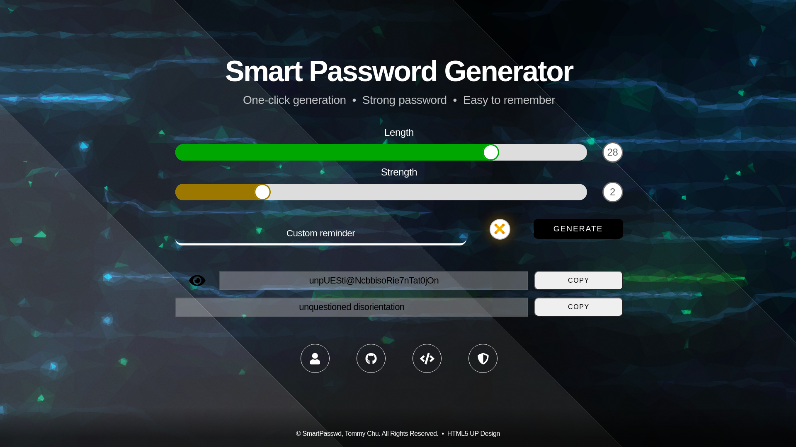

# Smart Passwd

Smart Passwd is a web application which helps people to generate strong passwords that are easy to remember.

## Features

### Strength level

Users can adjust the strength level of the password which adds another extra layer of security by inserting random
numbers or special characters into the result.

### Reminders

The generator creates each password along with its `reminder` which is a word or group of words that either graphically
or phonetically resemble the real password.

#### Custom reminders

Users can also provide their own reminder which makes the generator to create the password that corresponds with.

### Hide button

Hide button is placed on the left side of the `generated password` field. Three seconds after a password is generated
the values is hidden and its visibility can be toggled.

### Copy buttons

Both `generated password` and `reminder` have copy buttons to easily copy their values to clipboard. After pressing
either of them a green successful notification should appear.

## Examples with random reminders

### Fort short passwords

* Length:   6
* Strength: 0

#### outputs:

* `v&gon$` **[ wagons ]**
* `Sv&mi$` **[ swamis ]**
* `trcnDS` **[ trends ]**

### For long passwords

* Length:   20
* Strength: 2

#### outputs:

* `Or4PHanqeEIIn9$Gcrk8` **[ orphan peelings berk ]**
* `IO@fS@R1eHcolOGy$tS6` **[ loafs archeologists ]**
* `incONS0cqucntl44I@ak` **[ inconsequential oak ]**

## Examples with custom reminders

### Smart Password

* Strength: 0

#### outputs:

* `$Martq4$$vOrb`
* `sm@rTP&S$v0rD`
* `sMArTq&SsvORD`

### I like to eat pineapple

* Strength: 3

#### outputs:

* `yL2ikEt0!!Atpi2nc4PPle`
* `l9like))OE@8tplNc4PPlE`
* `lIyketOe4tqI7nc&^^qIe6`

## Support for mobile devices

Tablet / iPad view | Smartphone view
| :---: | :---: |
|  |  |

## License

The Aerial design is provided by HTML5 UP (cc 3.0), the WordNet 1.6 database by Princeton University
and the slider component by Brandon McConnell.

The project is under the MIT license open source software. I welcome contributions both big
and small! Please, take a look at the community [contributing notes](https://github.com/chutified/smart-passwd/blob/master/CONTRIBUTING.md).
